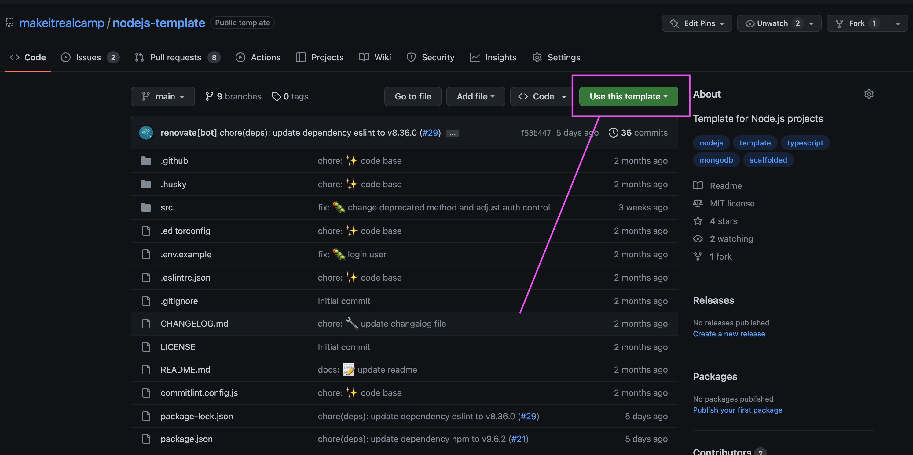

# Configuración de un proyecto Node.js

En Make It Real creemos que la mejor forma de aprender es haciendo, por eso, en cada uno de nuestros proyectos, te damos la libertad de elegir la herramienta que prefieras para crear tu proyecto.

## Creando un proyecto con Node.js

Para crear un proyecto con Node.js, debes ejecutar el comando `npm init` en la terminal, pasando como argumento el nombre del proyecto:

```bash
npm init
```

## Estructura de un proyecto Node.js
El patrón de diseño estructural más popular en el desarrollo de back-end es MVC. Es aplicable en la mayoría de las situaciones y no te equivocarás si lo eliges. Gira en torno a la estructuración de su aplicación en torno a las responsabilidades técnicas en ella. Tiene controladores que manejan las solicitudes y respuestas HTTP, modelos que obtienen datos de una base de datos y vistas que visualizan la respuesta.

En Make It Real, usamos una mejor forma de estructurar la aplicación de node que es en módulos que representen una parte del dominio. Cada una es una carpeta separada que contiene todos los controladores, modelos, pruebas y lógica comercial para una parte del negocio. Esta estructura da una idea de lo que está haciendo el servicio de un vistazo y tiene la confianza de que todo lo relacionado con los usuarios, por ejemplo, está en el módulo de usuario. No es necesario buscar en el código base para asegurarse de que no se ha perdido nada.

La siguiente estructura para nuestros proyectos Node.js:

```bash
com.example
├── modules
|   ├── user
|   |   ├── user.model.js
|   |   ├── user.services.js
|   |   ├── user.controller.js
|   |   ├── user.services.test.js
|   |   ├── index.js
|   ├── order
|   |   ├── order.model.js
|   |   ├── order.services.js
|   |   ├── order.controller.js
|   |   ├── order.services.test.js
|   |   ├── order.controller.test.js
|   |   ├── index.js
|   ├── catalog
|   |   ├── catalog.model.js
|   |   ├── product.services.js
|   |   ├── catalog.controller.js
|   |   ├── index.js
├── .gitignore
├── .env
├── .env.example
│   // and everything else in the project
└── index.js
```

## Pruebas Técnicas o Proyectos Personales

Si estás realizando una prueba técnica o un proyecto personal, puedes usar el template que el equipo de Make It Real creó para facilitar algunos pasos extras (Autenticación, test, documentación con swagger, entre otras.) que se pueden usar en proyectos reales.

- [Node.js Template](https://github.com/makeitrealcamp/nodejs-template)

Para usarlo, debes hacer clic en el boton `Use this template` que se encuentra en la parte superior derecha de la página. Luego, debes crear un nuevo repositorio en tu cuenta de GitHub y darle el nombre que prefieras.



## Referencias

- [Node.js Best Practices](https://alexkondov.com/tao-of-node/)
